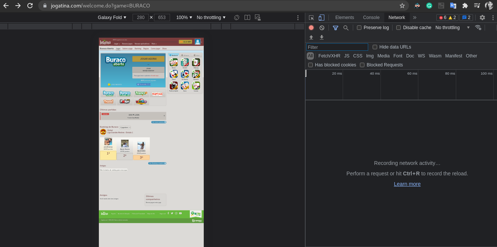
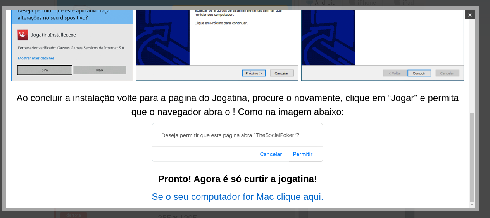

# Bug reports

## Referências

- Passou ✅
- Falhou ❌
- Dúvidas❔

## Test Case

### **Descrição**: Bug no modo mobile ❌

#### Caso de teste :
  - Acessar a tela jogatina.com
  - Abrir o F12 e mudar a resolução para o modo mobile
  - Selecionar uma marca de celular Ex:(Galaxy Fold)

#### Resultado Atual:
    Ao final da tela é possível verificar que o footer não está  no lugar correto

#### Resultado Esperado:
    O footer deve estar no final da  tela.

#### Evidências

1- 

### **Descrição**: Erro de ortografia ❌

#### Caso de Teste:
  - Entrar no site jogatina.com
  - Fazer Login
  - Clicar na aba "Jogar"
  - Clicar no link para instalar o aplicativo
  
#### Resultaldo Atual:
    No texto : "Ao concluir a instalação volte para a página do Jogatina, procure o novamente, clique em “Jogar" e permita que o navegador abra o ! Como na imagem abaixo:", a palavra  "abra o " esta sem o hífen.

#### Resultado Esperado:
    Que na palavra "Abra-o" , o hífen esteja inserido.

#### Evidencias

1- 